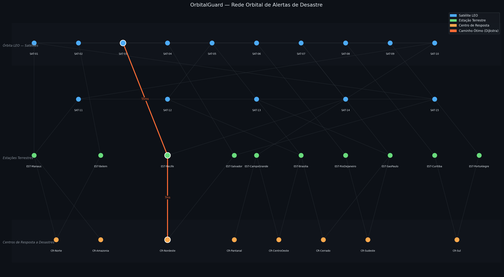

# 🛰️ OrbitalGuard — Dynamic Programming

> **Global Solution 2026 | FIAP | Space Connect**  
> Disciplina: Dynamic Programming
> Integrantes: Felipe Carlos Abreu (RM559476) | Gabriel dos Santos Teixeira (RM97233)

---

## 📌 Sobre o Projeto

O **OrbitalGuard** é um sistema de roteamento inteligente de alertas de desastres naturais por meio de uma rede orbital simulada. Quando um satélite detecta um evento crítico (queimada, enchente, deslizamento), o sistema determina automaticamente o **caminho de menor latência** para que o alerta chegue ao centro de resposta responsável pela região afetada.

A solução utiliza **grafos ponderados** e o **algoritmo de Dijkstra** para otimizar a transmissão do alerta pela rede de satélites LEO e estações terrestres brasileiras.

---

## 🌍 Contexto — Space Connect

O tema da Global Solution 2026 é a **Economia Espacial**: como tecnologias orbitais podem ser aplicadas para resolver desafios reais da Terra. O OrbitalGuard responde diretamente a esse desafio, usando dados satelitais e comunicação orbital para salvar vidas em situações de desastre.

**ODS alinhados:**
- 🏙️ ODS 11 — Cidades e Comunidades Sustentáveis
- 🌡️ ODS 13 — Ação contra a Mudança Global do Clima

---

## 🧩 Definição do Problema

**Dado:** Um satélite em órbita baixa (LEO) detecta um evento de desastre em uma região do Brasil.

**Pergunta:** Qual é o caminho de **menor latência total (ms)** para esse alerta trafegar pela rede orbital — passando por outros satélites e estações terrestres — até chegar ao centro de resposta correto?

**Por que Dijkstra?** A rede orbital é um grafo ponderado não-dirigido onde os pesos representam latência de comunicação. Dijkstra é o algoritmo clássico e eficiente para encontrar o caminho de menor custo em grafos com pesos não-negativos.

---

## 🗺️ Estrutura do Grafo

A rede orbital possui **33 nós** e **54 arestas bidirecionais**, organizados em três camadas:

| Camada | Tipo | Quantidade | Prefixo |
|--------|------|-----------|---------|
| Órbita LEO | Satélites | 15 | `SAT-` |
| Solo | Estações terrestres | 10 | `EST-` |
| Solo | Centros de resposta | 8 | `CR-` |

### Tipos de conexão e latências

```
Satélite ↔ Satélite  (malha inter-satelital): 20 – 80 ms
Satélite → Estação   (downlink):              30 – 100 ms
Estação  → Centro    (link terrestre):         5 – 20 ms
```

### Nós do grafo

**Satélites LEO:** SAT-01 a SAT-15

**Estações terrestres:** EST-Manaus, EST-Belem, EST-Recife, EST-Salvador, EST-Brasilia, EST-RioDeJaneiro, EST-SaoPaulo, EST-Curitiba, EST-PortoAlegre, EST-CampoGrande

**Centros de resposta:** CR-Norte, CR-Nordeste, CR-CentroOeste, CR-Sudeste, CR-Sul, CR-Amazonia, CR-Pantanal, CR-Cerrado

---

## 📊 Visualização do Grafo

O grafo é plotado em três faixas horizontais representando cada camada da rede. O **caminho ótimo** encontrado pelo Dijkstra é destacado em laranja com os pesos de cada aresta exibidos.



> 🔶 Laranja = caminho ótimo | 🔵 Azul = satélites | 🟢 Verde = estações | 🟠 Âmbar = centros de resposta

---

## ⚙️ Como Funciona — Lógica da Solução

### Fluxo principal

```
1. Criar a rede orbital (grafo)
       ↓
2. Definir o evento: satélite de origem + centro de destino
       ↓
3. Executar Dijkstra a partir do satélite sensor
       ↓
4. Reconstruir o caminho ótimo via predecessores
       ↓
5. Exibir caminho, latência total e detalhamento por salto
       ↓
6. Plotar o grafo com o caminho destacado
```

### Exemplo de execução

**Cenário:** SAT-03 detecta uma queimada no Nordeste.

```
[EVENTO DETECTADO]
  Satélite sensor  : SAT-03
  Centro de destino: CR-Nordeste

[CAMINHO ÓTIMO ENCONTRADO — DIJKSTRA]
  SAT-03 → EST-Recife → CR-Nordeste

  Latência total: 62 ms

[DETALHAMENTO DO CAMINHO ÓTIMO]
  SAT-03       → EST-Recife    (+55 ms)  acumulado: 55 ms
  EST-Recife   → CR-Nordeste  (+ 7 ms)  acumulado: 62 ms

[TOP 5 — MENORES LATÊNCIAS ATÉ CENTROS DE RESPOSTA]
  1. CR-Nordeste      →  62 ms
  2. CR-Norte         →  90 ms
  3. CR-CentroOeste   →  96 ms
  4. CR-Cerrado       →  97 ms
  5. CR-Sul           → 104 ms
```

---

## 🔧 Funções Implementadas

| Função | Descrição |
|--------|-----------|
| `criar_rede_orbital()` | Cria o grafo completo com nós, arestas, posições e tipos |
| `dijkstra(grafo, origem)` | Executa Dijkstra e retorna distâncias e predecessores |
| `reconstruir_caminho(predecessores, destino)` | Reconstrói a rota ótima do destino até a origem |
| `plotar_grafo(...)` | Plota o grafo com caminho destacado usando matplotlib |
| `main()` | Orquestra o fluxo completo da simulação |

---

## 🚀 Como Executar

### Pré-requisitos

```bash
pip install matplotlib
```

> `heapq` já faz parte da biblioteca padrão do Python — nenhuma instalação adicional necessária.

### Execução

```bash
python orbitalguard_dp.py
```

O script irá:
1. Montar a rede orbital
2. Executar o Dijkstra
3. Imprimir o caminho ótimo e detalhamento no terminal
4. Abrir a janela com o grafo plotado
5. Salvar o grafo como `orbitalguard_grafo.png`

---

## 📁 Estrutura do Repositório

```
orbitalguard/
├── orbitalguard_dp.py       # Código principal
├── orbitalguard_grafo.png   # Grafo gerado pela execução
└── README.md                # Este arquivo
```

---

## 🧠 Conceitos de Dynamic Programming Aplicados

- **Grafo ponderado não-dirigido** com dicionário de adjacência
- **Algoritmo de Dijkstra** com fila de prioridade (`heapq`)
- **Subproblemas ótimos**: a menor latência até qualquer nó intermediário é parte da solução global
- **Reconstrução do caminho** via rastreamento de predecessores
- **Relaxamento de arestas**: atualização de distâncias apenas quando encontramos um caminho melhor
